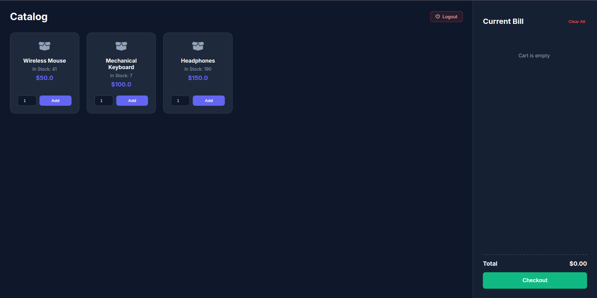
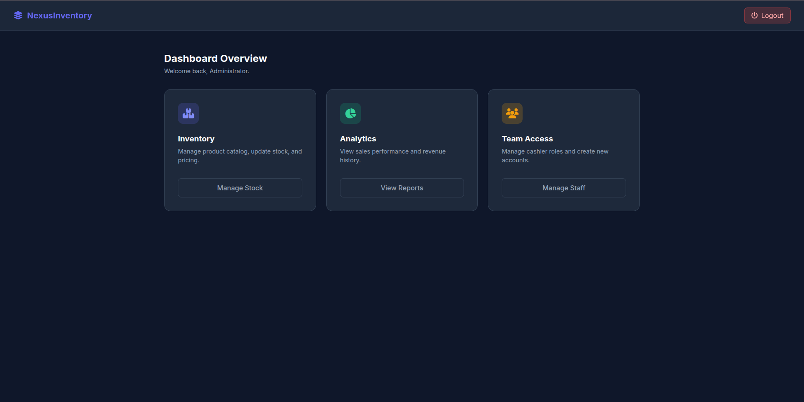
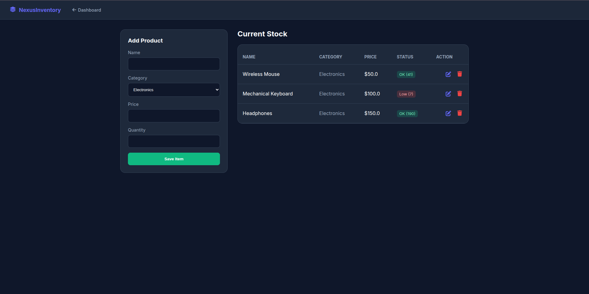
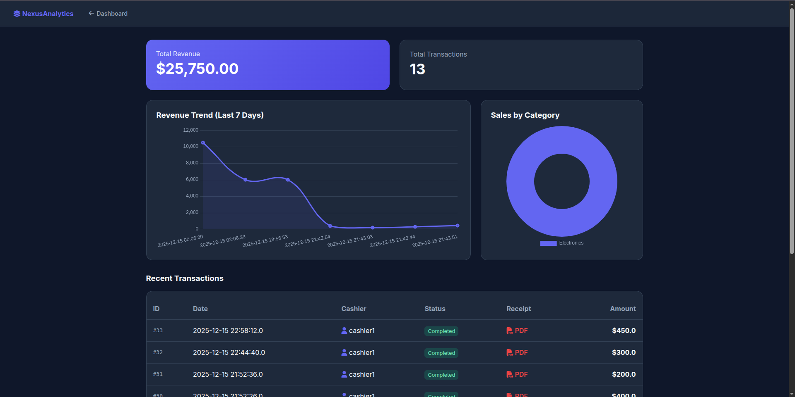

# 🛒 Nexus Inventory Management System

> A full-stack Point of Sale (POS) and Inventory Management solution built with Java EE, utilizing a complete CI/CD DevOps pipeline.

 
 
 
 


## 📖 Overview
Nexus is a robust web-based application designed to streamline retail operations. It separates concerns between **Administrators** (who manage stock, staff, and analytics) and **Cashiers** (who process sales). The system features a modern, responsive UI, real-time stock updates, PDF receipt generation, and an automated deployment pipeline.

## 🚀 Key Features

### 🛡️ Admin Dashboard
* **Analytics & Reporting:** Visual charts (Chart.js) showing revenue trends and sales by category.
* **Inventory Management:** Full CRUD capabilities for products.
* **Staff Management:** Add, edit, and remove system users (HR).
* **Security:** Role-Based Access Control (RBAC) preventing unauthorized access.

### 💰 Cashier Terminal (POS)
* **Visual Catalog:** "Card-based" product selection interface.
* **Shopping Cart:** Session-based cart management with real-time total calculation.
* **Transaction Processing:** Atomic database updates ensuring stock accuracy.
* **Receipts:** Auto-generated PDF receipts using **iText**.
* **Instant Feedback:** Toast notifications for success/error states.

---

## 🛠️ Tech Stack

| Component | Technology |
| :--- | :--- |
| **Frontend** | JSP, HTML5, CSS3 (Variables), JavaScript, Chart.js, FontAwesome |
| **Backend** | Java Servlets, JDBC, MVC Architecture |
| **Database** | MySQL (Relational Schema) |
| **Build Tool** | Apache Maven |
| **Server** | Apache Tomcat 9/10 (Port 8081) |
| **CI/CD** | Jenkins (Pipeline script via `Jenkinsfile`) |

---

## 📸 Screenshots

**POS Terminal**
> 

**Dashboard**
> 

**Inventory Management**
> 

**Analytics View**
> 

**Team Management**
> 

---

## ⚙️ Installation & Setup

### 1. Database Setup
Create a MySQL database named `inventory_db`. Run the following SQL script to create the schema and seed data:

```sql
-- 1. Create Database
CREATE DATABASE IF NOT EXISTS inventory_db;
USE inventory_db;

-- 2. Users Table
CREATE TABLE IF NOT EXISTS users (
    user_id INT AUTO_INCREMENT PRIMARY KEY,
    username VARCHAR(50) NOT NULL UNIQUE,
    password VARCHAR(255) NOT NULL,
    role VARCHAR(20) NOT NULL,
    full_name VARCHAR(100),
    email VARCHAR(100),
    created_at TIMESTAMP DEFAULT CURRENT_TIMESTAMP
);

-- 3. Products Table
CREATE TABLE IF NOT EXISTS products (
    product_id INT AUTO_INCREMENT PRIMARY KEY,
    name VARCHAR(100) NOT NULL,
    description TEXT,
    price DOUBLE NOT NULL,
    quantity INT DEFAULT 0,
    category VARCHAR(50),
    created_at TIMESTAMP DEFAULT CURRENT_TIMESTAMP
);

-- 4. Invoices Table
CREATE TABLE IF NOT EXISTS invoices (
    invoice_id INT AUTO_INCREMENT PRIMARY KEY,
    user_id INT,
    total_amount DOUBLE NOT NULL,
    date DATETIME DEFAULT CURRENT_TIMESTAMP,
    FOREIGN KEY (user_id) REFERENCES users(user_id) ON DELETE SET NULL
);

-- 5. Invoice Items Table
CREATE TABLE IF NOT EXISTS invoice_items (
    item_id INT AUTO_INCREMENT PRIMARY KEY,
    invoice_id INT,
    product_id INT,
    quantity INT NOT NULL,
    price DOUBLE NOT NULL,
    FOREIGN KEY (invoice_id) REFERENCES invoices(invoice_id) ON DELETE CASCADE,
    FOREIGN KEY (product_id) REFERENCES products(product_id)
);

-- SEED DATA
INSERT INTO users (username, password, role, full_name, email) VALUES 
('admin', '123', 'admin', 'System Administrator', 'admin@nexus.com'),
('cashier', '123', 'cashier', 'John Doe', 'cashier@nexus.com');

INSERT INTO products (name, description, price, quantity, category) VALUES 
('Wireless Mouse', 'Ergonomic 2.4GHz mouse', 15.99, 50, 'Electronics'),
('Mechanical Keyboard', 'RGB Backlit Blue Switch', 45.50, 20, 'Electronics'),
('USB-C Cable', 'Fast charging 2m cable', 5.99, 100, 'Accessories');
```
---

### 2. Server Configuration
This application is configured to run on **Port 8081** to avoid conflicts with Jenkins (which runs on 8080).

1.  Navigate to your Tomcat installation folder.
2.  Open `conf/server.xml`.
3.  Find the `<Connector>` tag that handles HTTP traffic.
4.  Change the port attribute:
    ```xml
    <Connector port="8081" protocol="HTTP/1.1" ... />
    ```
5.  Restart the Tomcat server.

### 3. CI/CD Pipeline (Jenkins)
This project uses a `Jenkinsfile` for automated building and deployment.

* **Checkout:** Jenkins pulls the latest code from the `main` branch.
* **Build:** Runs `mvn clean package` to generate the `.war` artifact.
* **Test:** Executes JUnit tests (if available).
* **Deploy:** Automatically copies the `NexusInventory.war` file to the Tomcat `webapps` directory (`/var/lib/tomcat9/webapps` or similar).

To run the pipeline:
1.  Create a new "Pipeline" job in Jenkins.
2.  Select "Pipeline script from SCM" -> Git.
3.  Enter the repository URL.
4.  Click **Build Now**.

---

## 🔒 Security Measures
* **Session Management:** Strict session invalidation on logout.
* **Cache Control:** `no-cache` headers added to JSP pages to prevent back-button access after logout.
* **Authorization:** Middleware checks on Admin pages (`dashboard.jsp`, `reports.jsp`) to ensure Cashiers cannot access them via direct URL entry.

---

## 👨‍💻 Author
Built by **Muhammad Arslan Jaffer** as a comprehensive Software Construction & Development project.
